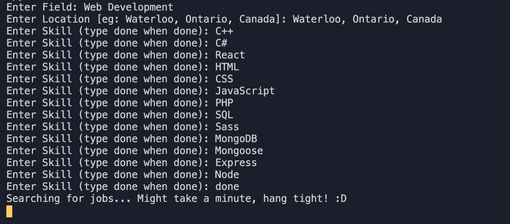

# job-scraper

A python script that takes in user input for their field of job search, location, and the skills they possess. It will then parse through linkedin job postings for that field and look for the skills in the job description and show the results that match skills.

## Usage

* Navigate to the directory where you want this project to be cloned.
* Clone this project by running `git clone https://github.com/Jaishreebala/job-scraper.git` in your terminal.
* Navigate to this project in the terminal by running `cd job-scraper`.
* Run the python script by typing `python app.py` in the terminal.
* Look at the steps in demonstration for further instructions.

## Demonstration:

__Step 1:__ Input your field, location and skills. (Can be left blank if needed but it is recommended to fill out as much information as possible for more customized results)

 

__Step 2:__ Wait for the script to find the jobs for for! :) 
Note: The results are ordered by highest match, and the skills that were matched is also shown in the results as well.
 
 

 __Step 3:__ Click the link to apply!

